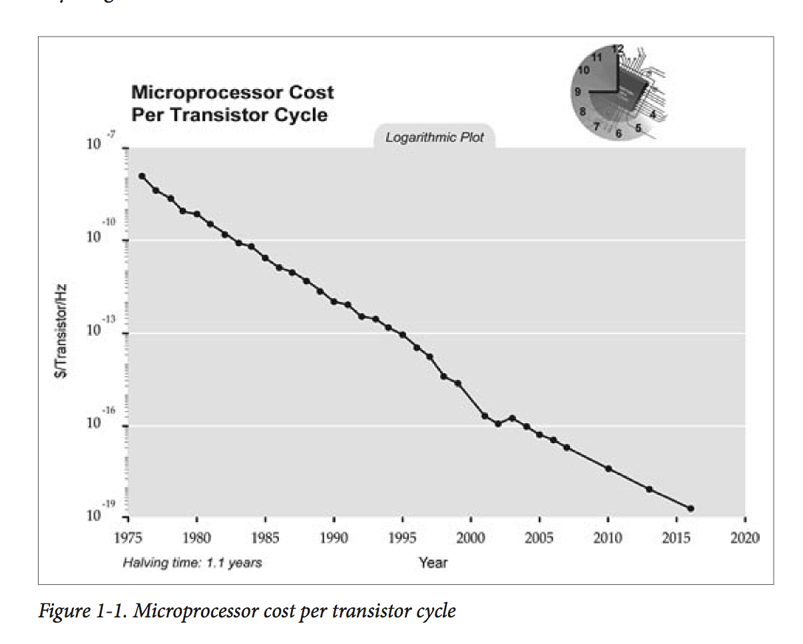

`testable JavaScript`
---
> `Testable JavaScript`英文版学习笔记

# 内容简介

* 了解敏捷的、测试驱动的开发以及行为驱动的开发
* 使用静态语言模式和基于标准的JavaScript来减少代码复杂度
* 学习基于事件架构的优势，包括模块性、松耦合以及可复用性
* 探索编写和运行函数级和应用级单元测试的工具
* 生成代码覆盖率来量度测试的范围和有效性
* 使用`Selenium`或者`CasperJS`进行集成、性能和负载测试
* 用于浏览器、`Node.js`、手机以及生产环境调试的工具
* 理解自动化开发流程的内容、时间和方式

# 内容安排

本书按如下步骤来实现可测试的代码。

1.  首先，调查复杂度；
2.  其次，如何通过架构来限制复杂度和耦合度；
3.  然后，测试（函数级别和应用级别的测试）；
> 通过这部分内容可以测底了解代码覆盖率（`Code Coverage`）和调试；
4.  最后，适量的自动化。

# 主要章节内容

## 第一章--可测试的代码（`Testable JavaScript`）

了解几个问题：

* 什么是可测试的代码（`testable code`）？
* 为什么要编写可测试的代码？
* 怎样做？

了解一些内容：

* 一些流行的开发方法论以及它们和可测试代码的关系
* 无论采用什么实践方式，编写可测试代码的关键在于：保持代码小巧、简洁、松耦合。

## 第二章--复杂度（`Complexity`）

复杂度是可测试性、可理解性和可维护性等许多问题的根源。而且其中的可理解性和可维护性是代码质量的关键度量标准。如何通过拆分、解耦等方法来降低复杂度、编写可测试的代码。

## 第三章--基于事件的架构（`Event-Based Architectures`）

讨论完复杂度，本章将深入探索基于事件的架构。这种应用级别的架构可以极大地降低复杂度和耦合度，并且轻松地将应用分解成较小的、更加自给自足的单元（`pieces`，原文用了这个词，我们理解成较小的单位就好了）。无论是在服务器端，还是在客户端，基于事件的架构都可以解决第二章列举的许多问题。即使这并不是适用于所有应用的总体架构，在总体架构中肯定也能用到基于事件架构的概念和实践。

## 第四章--单元测试（`Unit Tests`）

可测试的代码是如何保证代码能够单独拿出来执行的。为什么单元测试虽然不能找出所有`bug`，却仍然值得我们去做单元测试。以及单元测试的代码也要保持和你正在测试的代码一样的高标准，并且坚持相同的原则。

## 第五章--代码覆盖率（`Code Coverage`）

代码覆盖率通常和单元测试是一起的。代码覆盖率**是但也不总是**度量单元测试有效性的方法。代码覆盖率也不只是为了单元测试。所有测试都可以从代码覆盖率测量中受益，包括集成测试、手动测试和性能测试。我们将调查代码覆盖的好坏指标以及如何生成、查看和理解代码覆盖率。

## 第六章--集成、性能和负载测试（`Integration, Perfomance, and Load Testing`）

将功能模块化可以使得测试代码能够更加清晰地与实现的功能相关联，也能帮助开发者更快的修复`bug`。集成、性能和负载测试中的代码覆盖率可以快速展现黑盒测试中执行的代码。有许多很棒的`JavaScript`工具可供开发者在集成和性能测试中使用，我们将进一步了解这些工具。

## 第七章--调试（`Debugging`）

测试时找到的`bug`是最容易修复的`bug`，追踪用户在运行生产环境代码时找到的`bug`要困难得多。因为，你不仅要调试自己的代码，还需要去调试别人的代码。本章分享了一些调试`Node.js`和浏览器端代码的建议和技巧。介绍了调试环境的配置。

## 第八章--自动化（`Automation`）

手动一遍遍做事情不具有可持续性，也没有什么乐趣。编写软件是世界上最“手动”的事情，但是测试和维护却不一定是。自动话流程应该包括：执行测试、生成代码覆盖率报告、性能静态分析、压缩和合并代码、生产环境和其他环境代码的部署和回滚。自动化保证了速度以及更重要的**可重复性**。因为，你的代码会出错，测试会出错，生产发布会出错，而且还会出现一些和你的代码没有任何关系的问题，生活就是这样，但关键在于我们应该能够从这些出错（`failure`）中尽快而且无缝地恢复。

# 第一章--可测试的代码（`Testable JavaScript`）
---

首先，吐槽一下软件开发的方式，和几十年前一样，仍然非常“手动”，需要在“编写代码”，查看输出，修改代码这样的循环里进行。下面的图是每一次传感器循环的微处理器成本（`Microprocessor Cost Per Transistor Cycle`）。



我们看到，这条线遵循这摩尔定律（`Moore's law`）一直在下降。但是软件工程师，却仍然需要坐在自己的电脑前，一个字符一个字符地敲代码。

### 现有技术（`Prior Art`）

##### 敏捷开发（`Agile Development`）

与瀑布模型（`waterfall model`）相对。在瀑布模型中，写规范时，开发和测试处于等待状态；开发编码时，测试处于等待状态；测试测试时，其他所有人都在等。

敏捷开发更灵活，尝试让每个步骤并发进行。例如：将大任务拆成小任务、结对编程（两个人同时看一台电脑编程，一个人敲代码时，另一个人思考和`debug`）。下图是敏捷开发的规范示意：


##### 测试驱动的开发（`Test-Driven Development`，简称`TDD`）

理论上简单来说就是“先写测试，再编码”。

实际中要注意的是，最好是只写单元测试代码，不适合先写集成测试代码，最好在编写新项目或者新模块时使用。

结论，在编码前、编码中和编码后写测试代码都是好事！

##### 行为驱动开发（`Behavior-Driven Development`，简称`BDD`）

基于`TDD`，需要用户编写`User Story`来描述测试内容。需要符合一定格式，格式例如：

```
As a [someone] I want to [something] so that [result]
```

实例例如：

```
As in a Yahoo! Mail user I want to attach a picture to my email so that my recipients can see it.
```

可以不用代码，用一般语言描述就可以了。适用于从非本团队的人收集正式的反馈。

##### 为什么要编写可测试的代码？

> Writing software is the hardest thing people do.
> --Douglas Crockford

```
x = x + 1;
```

这段简单代码的问题？`x`是字符串、`infinity`或者对象怎么办？

**可维护性**

程序员通常不是从零开始写代码的。因此需要代码有可维护性。每个人都可能会调试和维护别人的代码。可测试的代码维护性肯定更好。这对于每个人来说都有好处。

**可理解性**

> 不用解释了吧

##### 什么是可测试的代码？

容易测试。特征与可维护、可理解的代码一样：不复杂、注释信息完整、松耦合。

即三个特征：

* `testabale`
* `maitainable`
* `understandable`

# 第二章--复杂度（`Complexity`）
---

### 方法一：命令查询分离（`Command Query Separation`）

命令（`Commands`）：做事情的函数。即`setters`

查询（`Queries`）：有返回值的函数。即`getters`
对`commands`的测试是通过`mock`（模拟）。对`queries`的测试是通过`stub`（根）。第四章会有这块内容的详解。

`command query`分离可以提供读写分离，提供了更大的扩展性。例如下面应用了`command query`分离的`Node.js`代码：

```
function configure(values) {
  var fs = require('fs'),
      config = { docRoot: '/somewhere' },
      key,
      stat;

  for (key in values) {
    config[key] = values[key];
  }

  try {
    stat = fs.statSync(config.docRoot);
    if (!stat.isDirectory()) {
      throw new Error('Is not valid');
    }
  } catch(e) {
    console.log("** " + config.docRoot + " does not exist or is not a directory");
    return;
  }

  // ... check other values ...
  return config;

}
```

相应的测试代码（先忽略具体语法，后面第四章会解释测试代码的语法细节）：

```
describe("configure tests", function() {
  it ("undef if docRoot does not exist", function() {
    expect(configure({ docRoot: '/xxx' })).toBeUndefined();
  });

  it ("not undef if docRoot does exist", function() {
    expect(configure({ docRoot: '/tmp' })).not.toBeUndefined();
  });

  it ("adds values to config hash", function() {
    var config = configure({ docRoot: '/tmp', zany: 'crazy' });
    expect(config).not.toBeUndefined();
    expect(config.zany).toEqual('crazy');
    expect(config.docRoot).toEqual('/tmp');
  });

  it ("verifies value1 good...", function() {
  });

  it ("verifies value1 bad...", function() {
  });

  // ... many more validation tests with multiple expects...
});
```

可以从测试代码看出我们上面的示例代码有这些问题：

* 函数做了太多事情：在设置默认配置值后，该函数继续检查配置值的有效性。
* 每个值的验证都包裹在了一个函数中，无法分离验证单个值。如果使用单元测试验证，会需要很多单元测试。
* 返回值会让人困惑：`undefined`或者完整有效的hash值。

> 其实根据上文，我们可以明显看出上面的代码将读操作和写操作混合在了一起。

解决方案是将这个函数拆分，例如：

```
function configure(values) {
  var config = { docRoot: '/somewhere' }, key;

  for (key in values) {
    config[key] = values[key];
  }

  return config;
}

function validateDocRoot(config) {
  var fs = require('fs'), stat;

  stat = fs.statSync(config.docRoot);

  if (!stat.isDirectory()) {
    throw new Error('Is not valid');
  }
}

function validateSomethingElse(config) { //... }
```

主要拆分在于设置值部分和验证函数（`commands`，没有返回值；可能会抛出错误）部分的拆分。这样的函数拆分使得我们的单元测试可以更加集中，也更加灵活。

```
describe("validae value1", function() {
    it("accepts the correct value", function() {
      // some expects
    });

    it("rejects the incorrect value", function() {
      // some expects
    });
});
```

这样的代码更加稳定，因为验证函数可以单独进行测试而不用包裹并且隐藏在一个比较通用的`configure`测试中。然而，问题在于，验证函数需要在`configure`函数中调用。这就是`command query`分离原则可能失效的地方。

```
function configure(values) {
  var config = { docRoot: '/somewhere' };
  for (var key in values) {
    config[key] = values[key];
    validateDocRoot(config);
    validateSomethingElse(config);
    // ...
    return config;
  }
}
```

这个新的`configure`函数可会返回一个有效的`config`对象或者抛出一个错误。而且所有的验证函数也可以从`configure`函数分离进行测试。

还可以优化的一点是：将`config`对象的所有键值链接到其验证函数并且在一个地方集中保存完整的`hash`内容。

```
var fields {
  docRoot: { 
    validator: validateDocRoot,
    default: '/somewhere'
  },
  somethingElse: {
    validator: validateSomethingElse
  }
}

function configure(values) {
  for (var key in values) {
    if (typeof values[key] !== 'undefined') {
      fields[key].validator(values[key]);
      config[key] = values[key];
    } else {
      config[key] = fields[key].default;
    }
  }
  return config;
}
```

这样代码可以更加轻松地用于单元测试，也可以在设置好新值后进行调用，所有与键值相关的数据都集中存储在了一个地方。

然而，作为题外话的一个问题是，如何有人运行下面的代码呢？

```
config.docRoot = '/does/not/exist';
```

验证函数将不会执行。对于对象，有一种非常棒的解决方案，使用ECMAScript5中的`Object`方法，这些方法会用内置的验证函数、`getter`、`setter`方法等来创建属性值，而且所有这些都是可测试的：

```
var obj = { realRoot: '/somewhere' };
Object.defineProperty(obj, 'docRoot', {
  {
    enumerable: true,
    set: function(value) {
      validateDocRoot(value);
      this.realRoot = value;
    }
  }
});
```

这样，执行`config.docRoot = '/does/not/exist';`这行代码时，会执行`set`函数，从而调用`validate`函数。在路径不存在时，`validate`函数会抛出一场，从而实现验证作用。

但是这会很奇怪，赋值函数会抛出异常从而需要用`try/catch`代码块包住。即使去掉`throw`，如果验证失败了，应该将`config.docRoot`设置为什么值呢？不管设成什么值，输出也是预料不到的。不可预料的输出意味着麻烦。而且，`docRoot`和`realRoot`这两个变量名字也会让人感到困惑。

一种更好的解决方案是使用带有`public gtter setter`（即公开的`get`和`set`方法）的私有属性。这样可以保持属性是私有的，而其他所有事情都是公开的，包括验证器，以保证可测试性：

```
var Obj = (function() {
  return function() {
    var docRoot = '/somewhere';
    this.validateDocRoot = function(val) {
      // 验证逻辑，如果失败则抛出错误
    };
    this.setDocRoot = function(val) {
      this.validateDocRoot(val);
      docRoot = val;
    };
    this.getDocRoot = function() {
      return docRoot;
    };
  };
}());
```

这样，只能通过我们的API来访问`docRoot`属性，这样可以强制在“写”时进行验证。用法如下：

```
var myObject = new Obj();
try {
  myObject.setDocRoot('/somewhere/else');
} catch(e) {
  // something wrong with my new doc root
  // old value of docRoot still there
}

// all is OK
console.log(myObject.getDocRoot);
```

不过，还有一个问题可能需要解决。

```
var myObject = new Obj();
myObject.docRoot = '/somewhere/wrong';

// and then later ...
var dR = myObject.docRoot;
```

API中的方法不知道这个`docRoot`域是由用户错误地创建的。修复的方法也很简单：

```
var Obj = (function() {
  return function() {
    var docRoot = '/somewhere';
    this.validateDocRoot = function(val) {
      // validation logic - throw Exception if not OK
    };
    this.setDocRoot = function(val) {
      this.validateDocRoot(val);
      docRool = val;
    };
    this.getDocRoot = function() {
      return docRoot;
    };
    Object.preventExtension(this)
  };
}());
```

使用`Object.preventExtension`方法可以在有人试图为对象添加属性时抛出`TypeError`错误。

修改后代码对应的测试代码如下：

```
describe("validate docRoot", function() {
    var config = new Obj();

    it("throw if docRoot does not exist", function() {
      expect(config.validateDocRoot.bind(config, '/xxx')).toThrow();
    });

    it("not throw if docRoot does exist", function() {
      expect(config.validateDocRoot.bind(config, '/tmp')).not.toThrow();
    });
});
```

`Command Query分离`并非唯一的方法，也并非总是可行，但却是一个好的起点。虽然`Command Query分离`方法有助于`JavaScript`的强项：事件，还有许多其他方法来管理代码的大小。

##### JSLint

虽然`JSLint`没有直接测量代码的复杂度，但是可以强迫开发者了解代码所做的事情。这样可以降低代码复杂度，确保开发者不会使用过于复杂或者容易出错的结构。或者简单地说，可以测量出代码的合理性（`Sanity`）。`JSLint`来源与`C`语言的`lint`，它会分析代码的风格、语法和句法，从而检测出代码可能存在的`坏内容`（`bad parts`）。

使用好代码替换掉坏代码是可测试JavaScript的本质。例如：

```
function sum(a, b) {
  return
    a + b;
}
```

在这个简单的例子上运行`JSLint`结果为：

> 可以在[www.jslint.com](http://www.jslint.com/)上实际操作试一下。
> 理解jslint,jshint和eslint的错误提示：[网站jslinterrors](http://jslinterrors.com/)
> 原文给出的jslint错误有7条，如下：
> ```
> Error:
>      Problem at line 2 character 5: Missing 'use strict' statement.
>  return
>      Problem at line 2 character 11: Expected ';' and instead saw 'a'.
>  return
>      Problem at line 3 character 8: Unreachable 'a' after 'return'.
>  a+b;
>      Problem at line 3 character 8: Expected 'a' at column 5,
>  not column 8.
>  a+b;
>      Problem at line 3 character 9: Missing space between 'a' and '+'.
>  a+b;
>      Problem at line 3 character 10: Missing space between '+' and 'b'.
>  a+b;
>      Problem at line 3 character 10: Expected an assignment or
>  function call and instead saw an expression.
>  a+b;
> ```
> 但是实际在jslint网站上测的结果为：
> ```
> Missing 'use strict' statement.
>    return
> line 2 character 9Expected ';' and instead saw 'a'.
>    return
> line 3 character 5Unreachable 'a' after 'return'.
>    a + b;
> ```

> 原书写作时JSLint对语法检查非常严格，观点也非常偏颇，强制要求按照Douglas的风格编写代码（大牛都这么有个性）。以致出现了`JSHint`这样的专门优化版本。看看详细的错误解释：

除了没有使用`use strict`声明，最大的问题在于`return`后面的回车符。因为分号的插入，`JavaScript`将从该函数返回`undefined`。`JSLint`捕获了这个错误，并且对该函数中的其他空白问题进行了“抱怨”。
